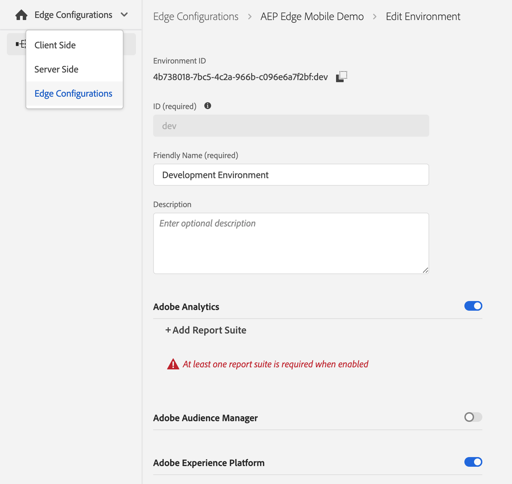

# Adobe Analytics Edge Beta


The AEP Analytics Edge mobile extension is currently in BETA. Use of this extension is by invitation only. Please contact your Adobe Customer Success Manager to learn more.


## **Configure the Adobe Experience Platform Edge extension in** Experience Platform **Launch**

1. In Experience Platform Launch, click the **Extensions** tab.
2. On the **Catalog** tab, locate the **Adobe Experience Platform Edge** extension, and click **Install**.
3. Within the Edge Extension configuration page add your Edge configuration and environment settings. For more information on creating an Edge configuration for use with your mobile app, see the [Edge extension readme](../adobe-edge/). 
4. Additionally, Analytics needs to be enabled in the Edge configuration. Select the configuration created in the previous step. Select development environment, enable Adobe Analytics and add a development report suite.



5. Click **Save**.
6. Publish the latest changes to your **Adobe Experience Platform Launch** configuration and proceed to adding the Analytics Edge extension in your mobile app.

## Add the Analytics Edge extension to your app



#### Java

1. Add the Mobile Core, Edge, and Analytics Edge extensions to your project using the app's Gradle file.

   ```java
    implementation 'com.adobe.marketing.mobile:sdk-core:1.+'
    implementation 'com.adobe.marketing.mobile:edge:1.+'
    implementation 'com.adobe.marketing.mobile:analyticsedge:1.+'
   ```

2. Import the AEP SDK extensions in your application's main activity.

   ```java
    import com.adobe.marketing.mobile.*;
   ```



#### Objective C

1. Add the Mobile Core, Edge, Identity, and Analytics Edge extensions to your project using Cocoapods.
2. Add the following pods in your `Podfile`:

   ```ruby
    pod 'AEPCore'
    pod 'AEPEdge'
    pod 'AEPIdentity'
    pod 'AEPAnalyticsEdge', :git => 'https://github.com/adobe/aepsdk-analyticsedge-ios', :tag => '1.0.0-beta.1'
   ```

3. Import the Mobile Core, Edge, Identity, Analytics Edge, and AEP Services libraries:

   **Objective-C**

   ```text
    @import AEPCore;
    @import AEPEdge;
    @import AEPIdentity;
    @import AEPAnalyticsEdge;
    @import AEPServices;
   ```

   **Swift**

   ```swift
    import AEPCore
    import AEPEdge
    import AEPIdentity
    import AEPAnalyticsEdge
    import AEPServices
   ```



### Register Analytics Edge with Mobile Core



#### Java

In your Application class, register Analytics Edge with Mobile Core in the `onCreate()` method:

```java
public class MobileApp extends Application {

    @Override
    public void onCreate() {
        super.onCreate();
        MobileCore.setApplication(this);
        MobileCore.configureWithAppID("yourAppId");
        try {
            Analytics.registerExtension(); //Register Analytics Edge with Mobile Core
            Identity.registerExtension();
            Edge.registerExtension();
            MobileCore.start(null);
        } catch (Exception e) {
            //Log the exception
         }
    }
}
```

**Important**: Analytics Edge depends on the Identity extension and is automatically included in Core by Maven. When manually installing the Analytics Edge extension, ensure that you add the `identity-1.x.x.aar` library to your project.



In your app's`application:didFinishLaunchingWithOptions`, register Analytics Edge with Mobile Core:

#### Objective C

```objectivec
- (BOOL)application:(UIApplication *)application didFinishLaunchingWithOptions:(NSDictionary *)launchOptions {
    [AEPMobileCore setLogLevel: AEPLogLevelTrace];
    NSArray *extensionsToRegister = @[AEPMobileEdge.class, AEPMobileIdentity.class, AEPMobileAnalytics.class];
    [AEPMobileCore registerExtensions:extensionsToRegister completion:nil];
    // Use the App id assigned to this application via Adobe Experience Platform Launch
    [AEPMobileCore configureWithAppId: @"yourAppId];
    // Override point for customization after application launch.
    return YES;
 }
```

#### Swift

```swift
func application(_ application: UIApplication, didFinishLaunchingWithOptions launchOptions: [UIApplication.LaunchOptionsKey: Any]?) -> Bool {
     MobileCore.setLogLevel(.trace)
     MobileCore.registerExtensions([Edge.self, Identity.self, Analytics.self])
     // Use the App id assigned to this application via Adobe Experience Platform Launch
     MobileCore.configureWith(appId: "yourAppId")
     // Override point for customization after application launch.
     return true;
}
```



## Send app states and actions to Analytics

To track mobile app states and actions in Adobe Analytics, implement the `trackAction` and `trackState` APIs from the Mobile Core extension. For more information, see [Track app actions](../mobile-core/mobile-core-api-reference.md#track-app-actions) and [Track app states](../mobile-core/mobile-core-api-reference.md#track-app-states-and-views).


`trackState` reports the View State as **Page Name**, and state views are reported as **Page View** in Analytics. The value is sent to Analytics by using the page name variable \(`pagename=value`\).

`trackAction` reports the Action as an **event** and does not increment your page views in Analytics. The value is sent to Analytics by using the action variable \(`action=value`\).




#### Java

```java
// create a context data dictionary
Map<String, String> additionalContextData = new HashMap<>();

// add data
additionalContextData.put("exampleCustomKey", "exampleValue");

// send a tracking call - use either a trackAction or TrackState call.
// trackAction example:
MobileCore.trackAction("Action Name", additionalContextData);
// trackState example:
MobileCore.trackState("State Name", additionalContextData);
```



#### Objective C

```objectivec
// create a context data dictionary
NSMutableDictionary *additionalContextData = [NSMutableDictionary dictionary];

// add data
[additionalContextData setObject:@"key" forKey:@"value"];

// send the tracking call - use either a trackAction or trackState call.
// trackAction example:
[AEPMobileCore trackAction:@"Action Name" data:additionalContextData];
// trackState example:
[AEPMobileCore trackState:@"State Name" data:additionalContextData];
```

#### Swift

```swift
// create a context data dictionary
let additionalContextData = ["key":"value"]

// send the tracking call - use either a trackAction or trackState call.
// trackAction example:
MobileCore.track(action: "Action Name", data: additionalContextData)
// trackState example:
MobileCore.track(state: "State Name", data: additionalContextData)
```



